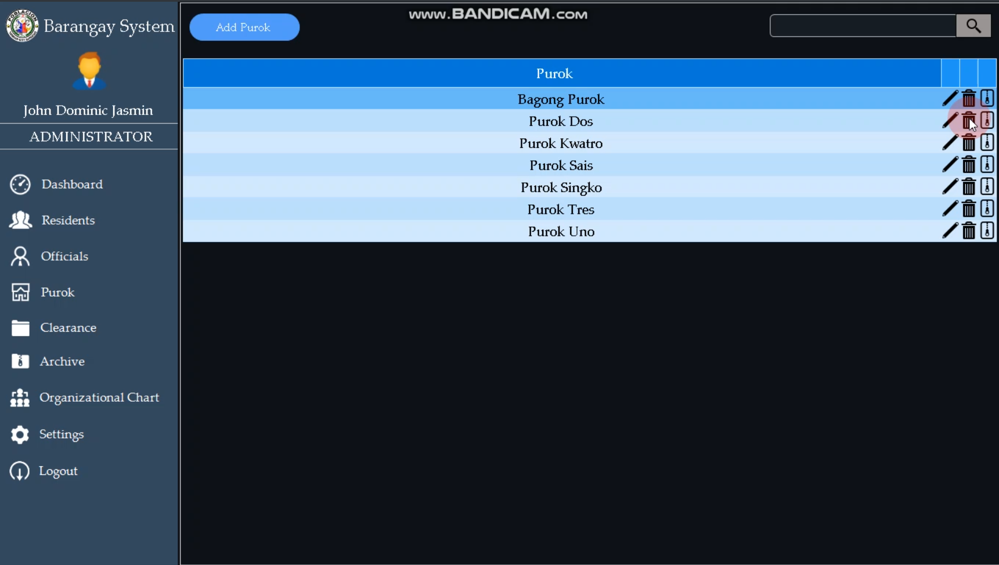
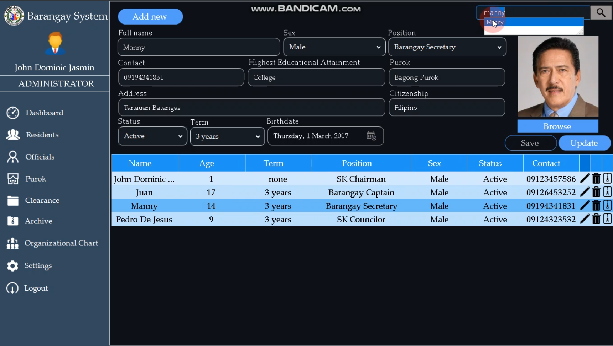
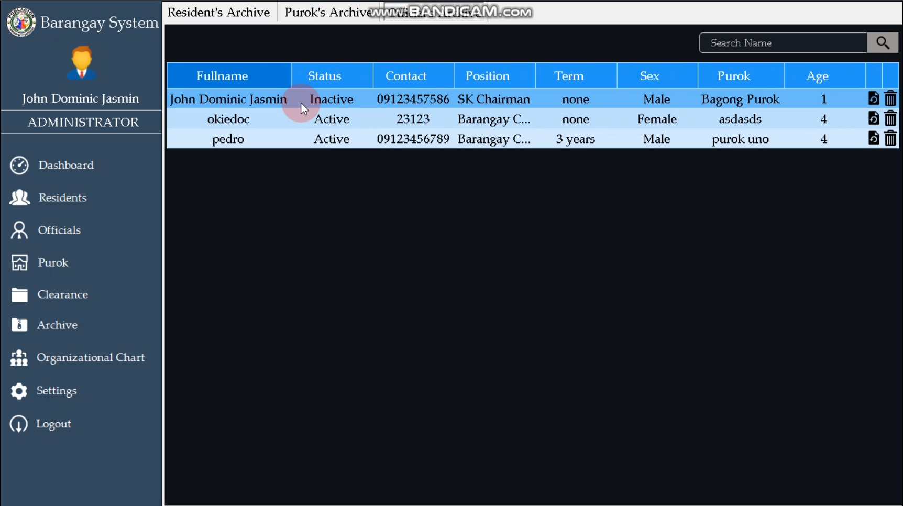
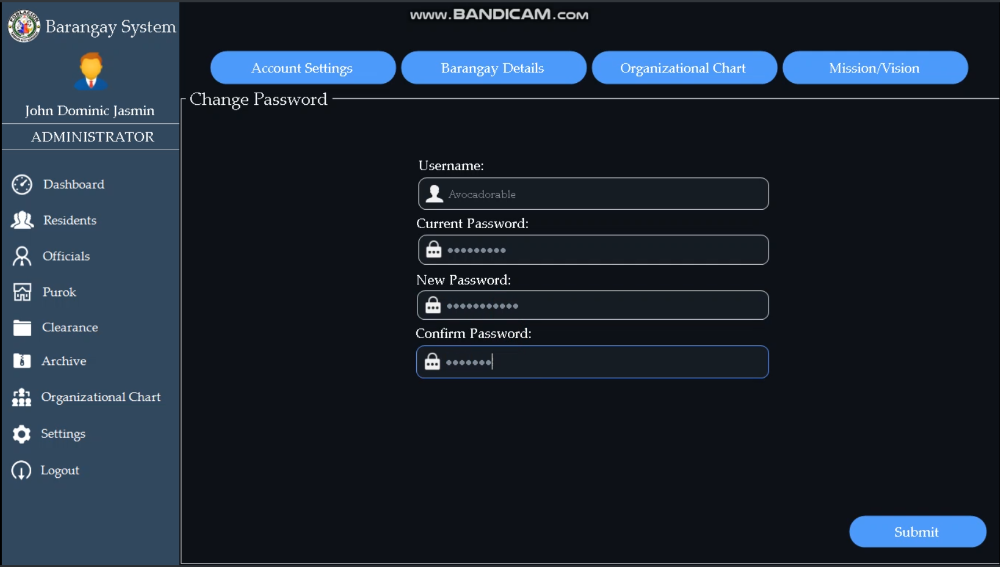
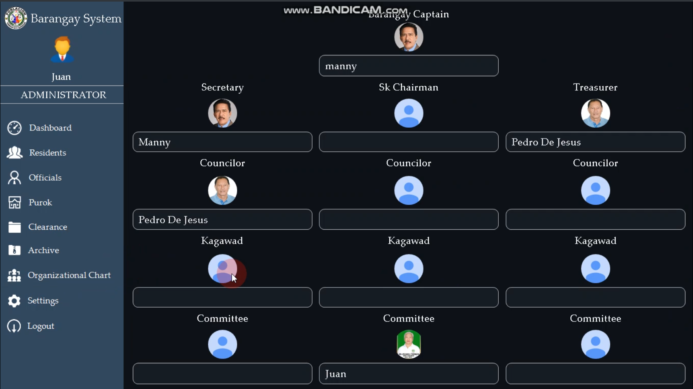
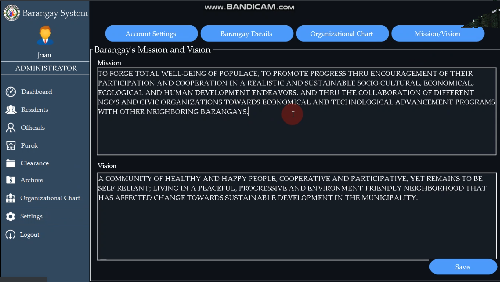
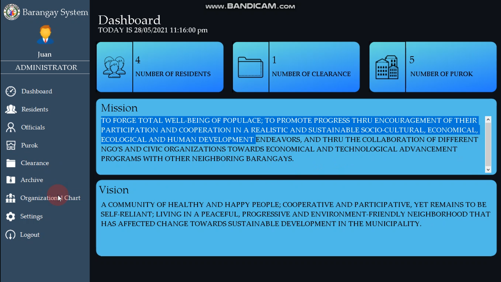
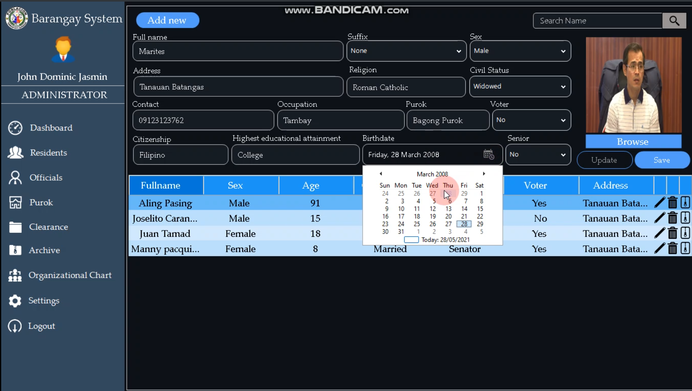
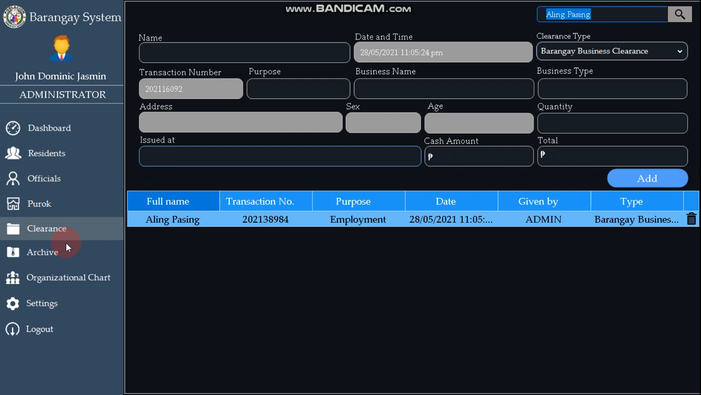
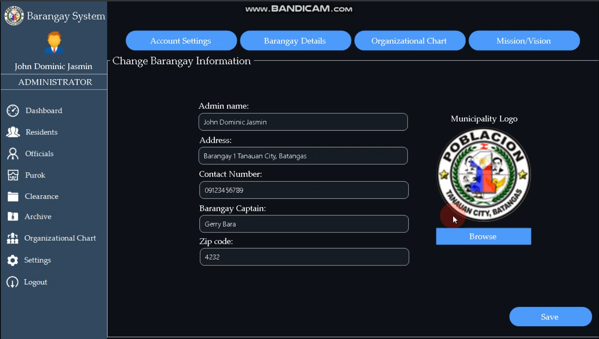

About

This Barangay Management System consisted of information of every person living inside of the given Barangay. In this system, we can input personal information and details of every individual inside the Barangay and save it inside the table. Our client hates writing every details to their logbook, as the list goes on the logbook/list gets messier and unorganized.

    
    
   

 

